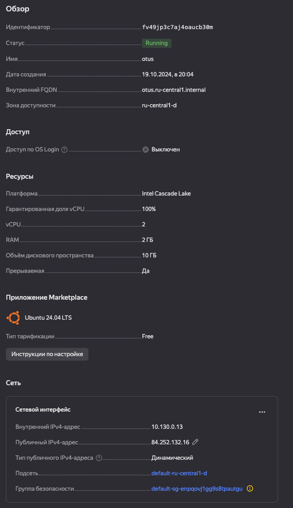
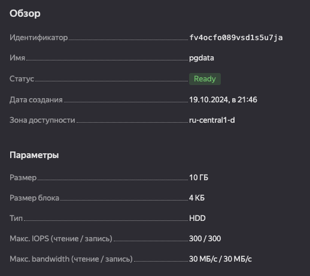
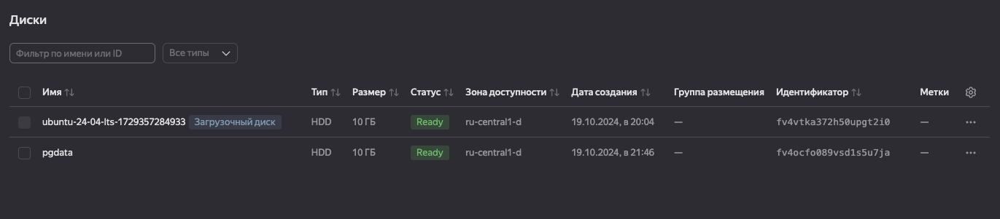

# ДЗ: Физической уровень БД

## Создайте виртуальную машину c Ubuntu 20.04/22.04 LTS в ЯО/Virtual Box/докере

ВМ создана в Яндекс Облаке: https://console.yandex.cloud



## 1. Поставьте на нее Postgres

```bash
sudo apt-get update
sudo apt install postgresql
```

## 2. Проверьте что кластер запущен через sudo -u postgres pg_lsclusters

```bash
root@otus:/opt/04# sudo -u postgres pg_lsclusters
Ver Cluster Port Status Owner    Data directory              Log file
16  main    5432 online postgres /var/lib/postgresql/16/main /var/log/postgresql/postgresql-16-main.log
```

## 3. Зайдите из под пользователя postgres в psql и сделайте произвольную таблицу с произвольным содержимым

```bash
root@otus:/opt/04# sudo -u postgres psql
postgres=# create table test(c1 text);
CREATE TABLE
postgres=# insert into test values('1');
INSERT 0 1
postgres=#
\q
```

## 4. Остановите postgres например через sudo -u postgres pg_ctlcluster 15 main stop

```bash
sudo -u postgres pg_ctlcluster 16 main stop
sudo -u postgres pg_lsclusters
Ver Cluster Port Status Owner    Data directory              Log file
16  main    5432 down   postgres /var/lib/postgresql/16/main /var/log/postgresql/postgresql-16-main.log
```

## 5. Создайте новый диск к ВМ размером 10GB

Создал новый диск в Яндекс Облаке: https://console.yandex.cloud




## 6. Добавьте свеже-созданный диск к виртуальной машине



## 7. Проинициализируйте диск согласно инструкции и подмонтировать файловую систему

Подключил дополнительный диск по инструкции: https://yandex.cloud/ru/docs/compute/operations/vm-control/vm-attach-disk?from=int-console-help-center-or-nav

```bash
# Отформатировал
artur@otus:~$ sudo mkfs.ext4 /dev/vdb
mke2fs 1.47.0 (5-Feb-2023)
Found a dos partition table in /dev/vdb
Proceed anyway? (y,N) y
Creating filesystem with 2621440 4k blocks and 655360 inodes
Filesystem UUID: b89de40b-4e28-4a9e-b81b-50185ec025cf
Superblock backups stored on blocks:
	32768, 98304, 163840, 229376, 294912, 819200, 884736, 1605632

Allocating group tables: done
Writing inode tables: done
Creating journal (16384 blocks): done
Writing superblocks and filesystem accounting information: done

# Подключил диск
sudo mkdir /mnt/pgdata && sudo mount /dev/vdb /mnt/pgdata
sudo chmod a+w /mnt/pgdata

# Настроил автомонтирование
sudo nano /etc/fstab
# Добавил в конец файла строку
UUID=b89de40b-4e28-4a9e-b81b-50185ec025cf /mnt/pgdata ext4 defaults 0 2
# Проверка состояния файловых систем после перезапуска сервера
artur@otus:~$ df
Filesystem     1K-blocks    Used Available Use% Mounted on
tmpfs             201504    1140    200364   1% /run
/dev/vda2       10230600 4307628   5434976  45% /
tmpfs            1007512    1052   1006460   1% /dev/shm
tmpfs               5120       0      5120   0% /run/lock
tmpfs             201500      12    201488   1% /run/user/1000
/dev/vdb        10218772      24   9678076   1% /mnt/pgdata
```


## 8. Перезагрузите инстанс и убедитесь, что диск остается примонтированным

```bash
artur@otus:~$ df
Filesystem     1K-blocks    Used Available Use% Mounted on
tmpfs             201504    1160    200344   1% /run
/dev/vda2       10230600 4324280   5418324  45% /
tmpfs            1007512    1052   1006460   1% /dev/shm
tmpfs               5120       0      5120   0% /run/lock
/dev/vdb        10218772      24   9678076   1% /mnt/pgdata
tmpfs             201500      12    201488   1% /run/user/1000
artur@otus:~$ uptime
 19:12:46 up 1 min,  1 user,  load average: 0.30, 0.20, 0.08
```

## 9. Сделайте пользователя postgres владельцем /mnt/data - chown -R postgres:postgres /mnt/data/

```bash
artur@otus:~$ ls -al /mnt
total 12
drwxr-xr-x  3 root root 4096 Oct 19 19:06 .
drwxr-xr-x 23 root root 4096 Oct 19 19:11 ..
drwxrwxrwx  3 root root 4096 Oct 19 19:03 pgdata
artur@otus:~$ sudo chown -R postgres:postgres /mnt/pgdata
artur@otus:~$ ls -al /mnt
total 12
drwxr-xr-x  3 root     root     4096 Oct 19 19:06 .
drwxr-xr-x 23 root     root     4096 Oct 19 19:11 ..
drwxrwxrwx  3 postgres postgres 4096 Oct 19 19:03 pgdata
```

## 10. Перенесите содержимое /var/lib/postgres/15 в /mnt/data - mv /var/lib/postgresql/15/mnt/data

Перенес файлы, предварительно остановив кластер

```bash
sudo -u postgres pg_ctlcluster 16 main stop
sudo -u postgres pg_lsclusters
sudo mv /var/lib/postgresql/16 /mnt/pgdata
# Проверка
artur@otus:~$ ls -al /var/lib/postgresql/
total 16
drwxr-xr-x  3 postgres postgres 4096 Oct 19 19:16 .
drwxr-xr-x 49 root     root     4096 Oct 19 17:38 ..
drwx------ 19      999 root     4096 Oct 19 18:31 data
-rw-------  1 postgres postgres   61 Oct 19 18:42 .psql_history
artur@otus:~$ ls -al /mnt/pgdata/
total 28
drwxrwxrwx 4 postgres postgres  4096 Oct 19 19:16 .
drwxr-xr-x 3 root     root      4096 Oct 19 19:06 ..
drwxr-xr-x 3 postgres postgres  4096 Oct 19 18:35 16
drwx------ 2 postgres postgres 16384 Oct 19 19:03 lost+found
```

## 11. Запуск кластера после переноса файлов 

```bash
artur@otus:~$ sudo -u postgres pg_ctlcluster 16 main start
Error: /var/lib/postgresql/16/main is not accessible or does not exist```
```
При запуске получил ошибку. Кластер не знает про то, что мы перенесли файлы в другое место. Надо изменить конфигурационный файл.

## 12. Найти конфигурационный параметр

```bash
sudo nano /etc/postgresql/16/main/postgresql.conf
# Изменил параметры
data_directory = '/mnt/pgdata/16/main'
# Перезапустил кластер
artur@otus:~$ sudo -u postgres pg_ctlcluster 16 main start
Warning: the cluster will not be running as a systemd service. Consider using systemctl:
  sudo systemctl start postgresql@16-main
artur@otus:~$ sudo -u postgres pg_lsclusters
Ver Cluster Port Status Owner    Data directory      Log file
16  main    5432 online postgres /mnt/pgdata/16/main /var/log/postgresql/postgresql-16-main.log
```
Кластер успешно запустился.

## 13. Через psql проверить наличие ранее созданных таблиц и их содержимое

```bash
artur@otus:~$ sudo -u postgres psql
psql (16.4 (Ubuntu 16.4-0ubuntu0.24.04.2))
Type "help" for help.

postgres=# select * from test;
 c1
----
 1
(1 row)
```

🫶🏼 Таблица успешно перенесена и данные не потерялись.
