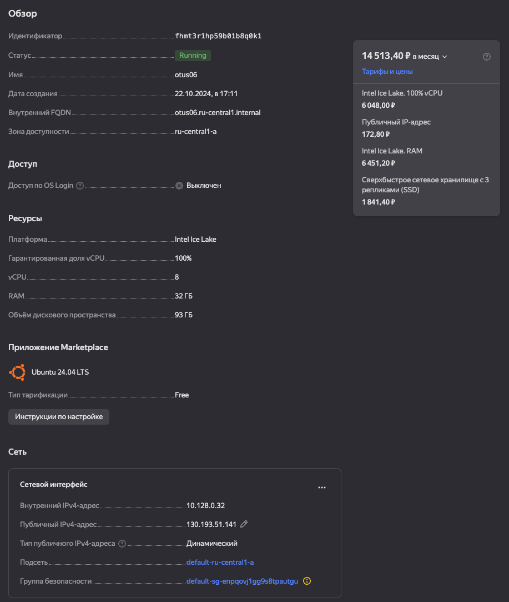
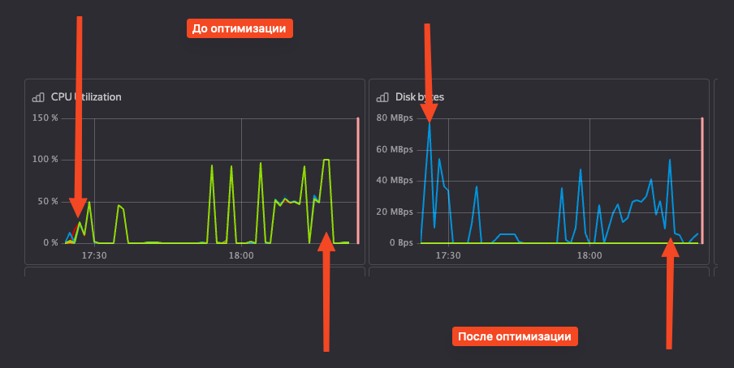

# Домашняя работы по теме "Настройка PostgreSQL"

## 1. Развернуть виртуальную машину любым удобным способом

Виртуальная машина развернута в Яндекс.Облаке:

- vCPU 8
- RAM 32 ГБ
- SSD 93 ГБ

Очень похожие конфигурации часто используются на рабочих проектах, поэтому это хороший вариант для тестирования.



## 2. Поставить на неё PostgreSQL 15 любым способом

На этот раз не стал отклоняться от инструкции и использовал указанную 15-ю версию.

```bash
root@otus06:/home/artur# apt-get update
root@otus06:/home/artur# sh -c 'echo "deb http://apt.postgresql.org/pub/repos/apt $(lsb_release -cs)-pgdg main" > /etc/apt/sources.list.d/pgdg.list'
root@otus06:/home/artur# wget -qO- https://www.postgresql.org/media/keys/ACCC4CF8.asc | sudo tee /etc/apt/trusted.gpg.d/pgdg.asc &>/dev/null
root@otus06:/home/artur# sudo apt update -y
root@otus06:/home/artur# sudo apt install postgresql-15 postgresql-client -y
```

Проверил, что кластер установлен:

```bash 
root@otus06:/home/artur# pg_lsclusters
Ver Cluster Port Status Owner Data directory Log file
15 main 5432 online postgres /var/lib/postgresql/15/main /var/log/postgresql/postgresql-15-main.log
```

## 3. Настроить кластер PostgreSQL 15 на максимальную производительность не обращая внимание на возможные проблемы с надежностью в случае аварийной перезагрузки виртуальной машины

Начальные рекомендации были получены через сервис https://pgtune.leopard.in.ua/. Далее настройки постепенно
тюнинговались для достижения максимального tps.

## 4. Нагрузить кластер через утилиту через утилиту pgbench (https://postgrespro.ru/docs/postgrespro/14/pgbench)

Заполнить базу данных тестовыми данными:

```bash
postgres@otus06:~$ pgbench -i -s 100 postgres
dropping old tables...
creating tables...
generating data (client-side)...
10000000 of 10000000 tuples (100%) done (elapsed 23.00 s, remaining 0.00 s)
vacuuming...
creating primary keys...
done in 29.17 s (drop tables 0.19 s, create tables 0.00 s, client-side generate 23.10 s, vacuum 0.19 s, primary keys 5.68 s).
```

### Тестирование производительности до оптимизации (tps = 3632)

```bash
postgres@otus06:~$ pgbench -c 50 -j 2 -T 60 postgres
pgbench (15.8 (Ubuntu 15.8-1.pgdg24.04+1))
starting vacuum...end.
transaction type: <builtin: TPC-B (sort of)>
scaling factor: 100
query mode: simple
number of clients: 50
number of threads: 2
maximum number of tries: 1
duration: 60 s
number of transactions actually processed: 218499
number of failed transactions: 0 (0.000%)
latency average = 13.765 ms
initial connection time = 58.747 ms
tps = 3632.340372 (without initial connection time)
```

### Тестирование проивзодительности после оптимизации (tps = 13933)

```bash
postgres@otus06:~$ pgbench -c 50 -j 2 -T 60 postgres
pgbench (15.8 (Ubuntu 15.8-1.pgdg24.04+1))
starting vacuum...end.
transaction type: <builtin: TPC-B (sort of)>
scaling factor: 100
query mode: simple
number of clients: 50
number of threads: 2
maximum number of tries: 1
duration: 60 s
number of transactions actually processed: 835757
number of failed transactions: 0 (0.000%)
latency average = 3.588 ms
initial connection time = 55.707 ms
tps = 13933.657805 (without initial connection time)
```

## 5. Написать какого значения tps удалось достичь, показать какие параметры в какие значения устанавливали и почему

Через мониторинг в Яндекс облаке из видимых изменений:

- утилизацию CPU удалось увеличить до 100% одновременно с максимизацией tps - это очень хорошо.
- использование диска уменьшилось с 80 MBps до 56 MBps. Результат хороший, с учетом почти 4 кратного увеличения tps.



```ini
max_connections = 150
shared_buffers = 10GB
effective_cache_size = 24GB
maintenance_work_mem = 2GB
checkpoint_completion_target = 0.9
wal_buffers = 32MB
default_statistics_target = 100
random_page_cost = 1.0
effective_io_concurrency = 400
work_mem = 6990kB
huge_pages = try
min_wal_size = 1GB
max_wal_size = 4GB
max_worker_processes = 8
max_parallel_workers_per_gather = 6
max_parallel_workers = 8
max_parallel_maintenance_workers = 4
fsync = off
synchronous_commit = off
```

Параметры, которые были изменены:

- `max_connections = 150`: Значение установлено для поддержки до `150` одновременных подключений. Это позволяет
  обслуживать большое количество пользователей, не перегружая систему. Очень часто встречаются системы в которых
  одновременно работает примерно 100 пользователей.

- `shared_buffers = 10GB`: Установлено на 10 ГБ, что составляет около 30% от общей оперативной памяти (32 ГБ). Это
  оптимальный размер для кэширования часто используемых данных в памяти, не перезагружая систему.

- `effective_cache_size = 24GB`: Установлено на 24 ГБ, что соответствует примерно 75% от доступной оперативной памяти.
  Это помогает планировщику запросов оценивать, сколько данных может быть кэшировано операционной системой и PostgreSQL.

- `maintenance_work_mem = 2GB`: установлено на 2 ГБ для ускорения операций обслуживания, таких как VACUUM и
  создание/перестроение индексов. Это уменьшает время выполнения таких операций, особенно на больших таблицах.

- `wal_buffers = 32MB`: Увеличено до 32 МБ для лучшей работы с большим количеством записей транзакций, что снижает
  частоту сброса данных в WAL на диск, улучшая производительность при интенсивной записи.

- `default_statistics_target = 100`: Увеличено для более точной статистики по распределению данных в таблицах. Это
  помогает планировщику запросов принимать лучшие решения по выбору индексов

- `random_page_cost = 1.0`: Значение снижено до 1.0 для SSD-дисков, поскольку случайный доступ на SSD происходит
  быстрее, чем на традиционных жестких дисках.

- `effective_io_concurrency = 400`: Значение высокое для использования возможностей SSD. Устанавливается, чтобы
  увеличить количество одновременных операций ввода-вывода, что особенно эффективно на быстрых дисках.

- `work_mem = 6990kB`: Размер выделяемой памяти для операций сортировки и хэширования. Установлен для того, чтобы было
  достаточно памяти для большинства операций, но при этом не использовать слишком много, что могло бы привести к
  увеличению общего потребления памяти при большом количестве соединений.

- `huge_pages = try`: Установлено как try, чтобы система использовала большие страницы памяти, если это возможно. Это
  может улучшить производительность за счет уменьшения накладных расходов на управление памятью.

- `max_worker_processes = 8`: Установлено в соответствии с количеством процессорных ядер (8), чтобы PostgreSQL мог
  эффективно использовать все доступные CPU.

- `max_parallel_workers_per_gather = 6`: Значение увеличено до 6 для увеличения параллелизма при выполнении сложных
  запросов, которые могут использовать несколько потоков для обработки.

- `max_parallel_workers = 8`: Установлено 8, что соответствует количеству процессоров. Это позволяет эффективно
  использовать многопоточность для параллельной обработки запросов.

- `max_parallel_maintenance_workers = 4`: Установлено 4, чтобы ускорить операции обслуживания (например, индексацию) с
  использованием параллелизма, не перегружая систему.

- `fsync = off`: Отключение fsync увеличивает производительность за счет того, что не выполняется жесткий сброс данных
  на диск после каждой транзакции. Это повышает скорость работы, но может привести к потере данных в случае аварийного
  завершения работы.

- `synchronous_commit = off`: Отключение синхронного коммита увеличивает производительность, так как не требуется
  ожидать подтверждения записи данных на диск перед завершением транзакции. Это снижает задержки, но увеличивает риск
  потери данных в случае сбоя.