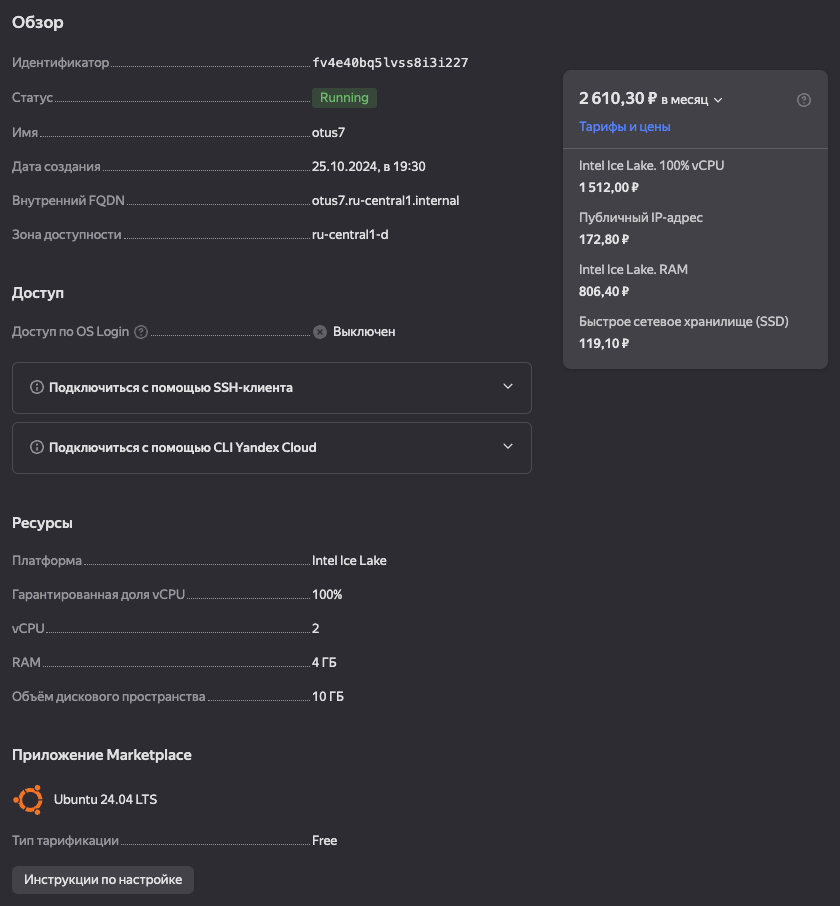

# Домашняя работа по теме "MVCC, vacuum и autovacuum"

## 1. Создать инстанс ВМ с 2 ядрами и 4 Гб ОЗУ и SSD 10GB



## 2. Установить на него PostgreSQL 15 с дефолтными настройками

```bash
apt-get update
sh -c 'echo "deb http://apt.postgresql.org/pub/repos/apt $(lsb_release -cs)-pgdg main" > /etc/apt/sources.list.d/pgdg.list'
wget -qO- https://www.postgresql.org/media/keys/ACCC4CF8.asc | sudo tee /etc/apt/trusted.gpg.d/pgdg.asc &>/dev/null
apt update -y
apt install postgresql-15 postgresql-client -y
```

Кластер запущен:

```bash
root@otus7:/home/artur# pg_lsclusters
Ver Cluster Port Status Owner    Data directory              Log file
15  main    5432 online postgres /var/lib/postgresql/15/main /var/log/postgresql/postgresql-15-main.log
```

## 3. Создать БД для тестов: выполнить pgbench -i postgres

```bash
postgres@otus7:/home/artur$ pgbench -i postgres
dropping old tables...
NOTICE:  table "pgbench_accounts" does not exist, skipping
NOTICE:  table "pgbench_branches" does not exist, skipping
NOTICE:  table "pgbench_history" does not exist, skipping
NOTICE:  table "pgbench_tellers" does not exist, skipping
creating tables...
generating data (client-side)...
100000 of 100000 tuples (100%) done (elapsed 0.07 s, remaining 0.00 s)
vacuuming...
creating primary keys...
done in 1.21 s (drop tables 0.00 s, create tables 0.01 s, client-side generate 0.10 s, vacuum 0.04 s, primary keys 1.06 s).
```

## 4. Запустить pgbench -c8 -P 6 -T 60 -U postgres postgres

```bash
postgres@otus7:/home/artur$ pgbench -c8 -P 6 -T 60 -U postgres postgres
pgbench (15.8 (Ubuntu 15.8-1.pgdg24.04+1))
starting vacuum...end.
progress: 6.0 s, 586.0 tps, lat 13.594 ms stddev 9.972, 0 failed
progress: 12.0 s, 789.5 tps, lat 10.136 ms stddev 8.127, 0 failed
progress: 18.0 s, 502.7 tps, lat 15.882 ms stddev 16.532, 0 failed
progress: 24.0 s, 528.3 tps, lat 15.172 ms stddev 15.189, 0 failed
progress: 30.0 s, 641.8 tps, lat 12.435 ms stddev 10.849, 0 failed
progress: 36.0 s, 705.7 tps, lat 11.341 ms stddev 9.255, 0 failed
progress: 42.0 s, 645.5 tps, lat 12.406 ms stddev 11.060, 0 failed
progress: 48.0 s, 410.2 tps, lat 19.456 ms stddev 21.893, 0 failed
progress: 54.0 s, 490.0 tps, lat 16.366 ms stddev 17.011, 0 failed
progress: 60.0 s, 710.0 tps, lat 11.229 ms stddev 9.901, 0 failed
transaction type: <builtin: TPC-B (sort of)>
scaling factor: 1
query mode: simple
number of clients: 8
number of threads: 1
maximum number of tries: 1
duration: 60 s
number of transactions actually processed: 36066
number of failed transactions: 0 (0.000%)
latency average = 13.306 ms
latency stddev = 13.113 ms
initial connection time = 16.727 ms
tps = 600.969159 (without initial connection time)
```

## 5. Применить параметры настройки PostgreSQL из прикрепленного к материалам занятия файла

В конец файла /etc/postgresql/15/main/postgresql.conf добавил строки:

```
# DB Version: 11
# OS Type: linux
# DB Type: dw
# Total Memory (RAM): 4 GB
# CPUs num: 1
# Data Storage: hdd

max_connections = 40
shared_buffers = 1GB
effective_cache_size = 3GB
maintenance_work_mem = 512MB
checkpoint_completion_target = 0.9
wal_buffers = 16MB
default_statistics_target = 500
random_page_cost = 4
effective_io_concurrency = 2
work_mem = 65536kB
min_wal_size = 4GB
max_wal_size = 16GB
```

Перезапустил кластер:
``bash
pg_ctlcluster 15 main restart
``

## 6. Протестировать заново

```bash
postgres@otus7:/home/artur$ pgbench -c8 -P 6 -T 60 -U postgres postgres
pgbench (15.8 (Ubuntu 15.8-1.pgdg24.04+1))
starting vacuum...end.
progress: 6.0 s, 653.2 tps, lat 12.189 ms stddev 10.726, 0 failed
progress: 12.0 s, 661.2 tps, lat 12.102 ms stddev 10.150, 0 failed
progress: 18.0 s, 547.5 tps, lat 14.594 ms stddev 14.481, 0 failed
progress: 24.0 s, 521.7 tps, lat 15.363 ms stddev 14.650, 0 failed
progress: 30.0 s, 840.2 tps, lat 9.485 ms stddev 7.307, 0 failed
progress: 36.0 s, 727.7 tps, lat 11.024 ms stddev 9.511, 0 failed
progress: 42.0 s, 811.8 tps, lat 9.855 ms stddev 8.098, 0 failed
progress: 48.0 s, 610.5 tps, lat 13.088 ms stddev 12.275, 0 failed
progress: 54.0 s, 592.8 tps, lat 13.509 ms stddev 12.740, 0 failed
progress: 60.0 s, 826.3 tps, lat 9.669 ms stddev 7.713, 0 failed
transaction type: <builtin: TPC-B (sort of)>
scaling factor: 1
query mode: simple
number of clients: 8
number of threads: 1
maximum number of tries: 1
duration: 60 s
number of transactions actually processed: 40765
number of failed transactions: 0 (0.000%)
latency average = 11.771 ms
latency stddev = 10.832 ms
initial connection time = 17.053 ms
tps = 679.404302 (without initial connection time)
```

## 7. Что изменилось и почему?

- TPS (Transactions Per Second):
    - Первый запуск: 600.97 TPS
    - Второй запуск: 679.40 TPS
    - TPS увеличилось примерно на 13%, что говорит об улучшении способности базы данных обрабатывать больше транзакций
      за тот же период времени.
- Latency (Средняя задержка):
    - Первый запуск: 13.306 ms
    - Второй запуск: 11.771 ms
    - Средняя задержка уменьшилась, что указывает на более быструю обработку транзакций.
- Stddev (Стандартное отклонение задержки):
    - Значение стало более стабильным.

### Почему?

- Увеличение `shared_buffers` позволило эффективно кэшировать данные и уменьшить количество обращений к диску
- Увеличение `max_wal_size` снижает нагрузку на диск
- Увеличение `work_mem` позволяет больше данных обрабатывать в памяти и меньше скидывать во временные файлы

## 8. Создать таблицу с текстовым полем и заполнить случайными или сгенерированными данным в размере 1млн строк

```sql
CREATE TABLE tags
(
    id  serial,
    tag char(100)
); 
```

Заполнение таблицы `1 000 000` строк:

```sql
INSERT INTO tags (tag)
SELECT chr(trunc(65 + random() * 25)::int) ||
       chr(trunc(65 + random() * 25)::int) ||
       chr(trunc(65 + random() * 25)::int) ||
       chr(trunc(65 + random() * 25)::int) ||
       chr(trunc(65 + random() * 25)::int)
FROM generate_series(1, 1000000);
```

Проверка количества строк:

```bash
postgres=# select count(*) from tags;)
  count
---------
 1000000
(1 row)
```

Каждая строка содержит 5 случайных символов:

```
postgres=# select * from tags limit 10;
 id |                                                 tag
----+------------------------------------------------------------------------------------------------------
  1 | MEXKX
  2 | DGPKM
  3 | JJHKG
  4 | RLGNK
  5 | BCKJX
  6 | JHXOY
  7 | QHIIW
  8 | NHPBP
  9 | CAEMF
 10 | QRQHE
(10 rows)
```

## 9. Посмотреть размер файла с таблицей

```
postgres=# SELECT pg_size_pretty(pg_total_relation_size('tags'));
 pg_size_pretty
----------------
 135 MB
(1 row)
```

## 10. 5 раз обновить все строчки и добавить к каждой строчке любой символ

```
DO $$
DECLARE
    i INT;
BEGIN
    FOR i IN 1..5 LOOP
        UPDATE tags
        SET tag = tag || chr(trunc(65 + random() * 25)::int);
    END LOOP;
END $$;
```

Размер таблицы увеличился со 125 Мб до 808 Мб:

```
postgres=# select * from tags limit 10;
 id |                                                 tag
----+------------------------------------------------------------------------------------------------------
  1 | MEXKXKXENF
  2 | DGPKMPHIKP
  3 | JJHKGGNAJD
  4 | RLGNKLKAJQ
  5 | BCKJXCTHFK
  6 | JHXOYMUUNU
  7 | QHIIWTIXIM
  8 | NHPBPFTPPL
  9 | CAEMFCIVBL
 10 | QRQHEWMQFN
(10 rows)

postgres=# SELECT pg_size_pretty(pg_total_relation_size('tags'));
 pg_size_pretty
----------------
 808 MB
(1 row)
```

## 11. Посмотреть количество мертвых строчек в таблице и когда последний раз приходил автовакуум

```
postgres=# SELECT relname, n_live_tup, n_dead_tup, trunc(100*n_dead_tup/(n_live_tup+1))::float AS "ratio%", last_autovacuum FROM pg_stat_user_tables WHERE relname = 'tags';
 relname | n_live_tup | n_dead_tup | ratio% |        last_autovacuum
---------+------------+------------+--------+-------------------------------
 tags    |    1000000 |    5000000 |    499 | 2024-10-25 17:12:50.076634+00
(1 row)
```

Кол-во мертвых строк равно 5000000. Что составляет 499% от кол-ва живых строк.

## 12. Подождать некоторое время, проверяя, пришел ли автовакуум

Автовакуум запустился буквально через минуту.

```
postgres=# SELECT relname, n_live_tup, n_dead_tup, trunc(100*n_dead_tup/(n_live_tup+1))::float AS "ratio%", last_autovacuum FROM pg_stat_user_tables WHERE relname = 'tags';
 relname | n_live_tup | n_dead_tup | ratio% |        last_autovacuum
---------+------------+------------+--------+-------------------------------
 tags    |    1000000 |          0 |      0 | 2024-10-25 17:13:47.754247+00
(1 row)
```

## 13. 5 раз обновить все строчки и добавить к каждой строчке любой символ

Повторно запустил добавление символов к строкам:

```
DO $$
DECLARE
    i INT;
BEGIN
    FOR i IN 1..5 LOOP
        UPDATE tags
        SET tag = tag || chr(trunc(65 + random() * 25)::int);
    END LOOP;
END $$;
```

## 14. Посмотреть размер файла с таблицей

Размер таблицы не поменялся.

```
postgres=# SELECT pg_size_pretty(pg_total_relation_size('tags'));
 pg_size_pretty
----------------
 808 MB
(1 row)

postgres=# select * from tags limit 10;
   id   |                                                 tag
--------+------------------------------------------------------------------------------------------------------
 999193 | RCBWWVGUUTUICXY
 999194 | NAUUAFYDFYGRHHG
 999195 | TPQFLEOLIRUEUJB
 999196 | SEJAVLGQEQKQKTA
 999197 | JTYHLOPMNKECHHO
 999198 | NKGLQYEPQIIJREQ
 999199 | ONNVTAFUKLGNSNA
 999200 | FJVWIGGBYRXCTCI
 999201 | TJLNQSKWSNYFWQD
 999202 | FHCYTCPVNXJJUGL
(10 rows)
```

```
postgres=# SELECT relname, n_live_tup, n_dead_tup, trunc(100*n_dead_tup/(n_live_tup+1))::float AS "ratio%", last_autovacuum FROM pg_stat_user_tables WHERE relname = 'tags';
 relname | n_live_tup | n_dead_tup | ratio% |        last_autovacuum
---------+------------+------------+--------+-------------------------------
 tags    |    1000000 |    5000000 |    499 | 2024-10-25 17:12:50.076634+00
(1 row)

postgres=# SELECT relname, n_live_tup, n_dead_tup, trunc(100*n_dead_tup/(n_live_tup+1))::float AS "ratio%", last_autovacuum FROM pg_stat_user_tables WHERE relname = 'tags';
 relname | n_live_tup | n_dead_tup | ratio% |        last_autovacuum
---------+------------+------------+--------+-------------------------------
 tags    |    1000000 |          0 |      0 | 2024-10-25 17:34:45.367785+00
(1 row)
```

## 15. Отключить Автовакуум на конкретной таблице

```
alter table tags set (autovacuum_enabled = off);
```

## 16. 10 раз обновить все строчки и добавить к каждой строчке любой символ

```
DO $$
DECLARE
    i INT;
BEGIN
    FOR i IN 1..10 LOOP
        UPDATE tags
        SET tag = tag || chr(trunc(65 + random() * 25)::int);
    END LOOP;
END $$;
```

## 17. Посмотреть размер файла с таблицей

```
postgres=# SELECT pg_size_pretty(pg_total_relation_size('tags'));
 pg_size_pretty
----------------
 1482 MB
(1 row)
```

## 18. Объясните полученный результат

- Размер таблицы увеличился с 808 Мб до 1482 Мб. Менее чем в 2 раза. Скорее всего это из-за HOT (Heap-Only Tuples)
  Updates. Старые версии строк сохраняются внутри одной и той же страницы, если есть доступное место.
- PostgreSQL пытается повторно использовать "свободное" место в таблице, оставшееся после предыдущих удалений или
  обновлений.

## 19. Не забудьте включить автовакуум)

```
alter table tags set (autovacuum_enabled = on);
```